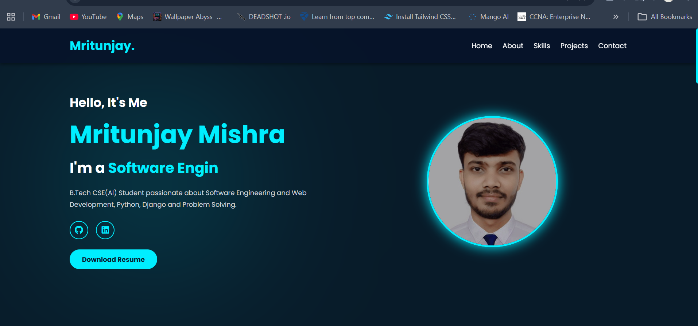

1. Project Title
# Personal Portfolio Website
2. Short Description
A modern responsive personal portfolio website built using HTML, CSS and JavaScript to showcase my projects, skills, certifications and education.
3. Live Demo Link
## Live Demo

🔗 [https://your-vercel-link.vercel.app](https://portfolio-nine-amber-41.vercel.app/)

Replace with your real Vercel URL.

4. Preview Image (Very Important)

Add screenshot.

## Preview



Take screenshot of homepage and save:

assets/preview.png
5. Features Section
## Features

- Responsive Design
- Modern UI/UX
- Typing Animation
- Animated Sections
- Skills Popup
- Certificates Section
- Scroll Animations
- Mobile Navigation
- Smooth Scrolling
- Scroll To Top Button
6. Tech Stack
## Tech Stack

- HTML5
- CSS3
- JavaScript
- Font Awesome
- Google Fonts
7. Folder Structure
## Folder Structure

portfolio/
│
├── index.html
├── style.css
├── script.js
│
├── assets/
│   ├── profile.jpg
│   ├── resume.pdf
│   ├── M1.jpg
│   └── M2.jpg

8. How To Run
## Run Locally

1. Clone the repository

```bash
git clone https://github.com/yourusername/portfolio.git
Open project folder
Run index.html using Live Server

---

# 9. About Me

```md id="y7m6v2"
## About Me

I am a B.Tech Computer Science Engineering student specializing in Artificial Intelligence at Galgotias University. Passionate about Software Engineering, Frontend Development and Problem Solving.
10. Connect With Me
## Connect With Me

- LinkedIn: https://linkedin.com/in/your-link
- GitHub: https://github.com/your-github
11. License (Optional)
## License

This project is open source and available under the MIT License.
